# Media

Stills and GIFs for the repository README. `tools/media` makes them.

Captures use demo mode (`APPARATUS_DEMO=1`: scripted jobs) with scripted voice; real jobs take minutes.
Every frame is the real web client, except the watch: that is the Wear OS app, rendered with Paparazzi.
The Screen shows a bare X session, not the VM image's XFCE desktop.
Every capture shows the default look, Borders off, except `borders-split`.

## Regenerate

```sh
npm install                     # at the root: every workspace
npm run build -w apps/web
MEDIA_ZONE=Etc/GMT-7 node tools/media/capture.mjs --out docs/media   # one clock for every scene
rm docs/media/audit*.png docs/media/borders-on*.png   # made by the day scene, not published
```

`tools/media/README.md` lists the scenes, the options and what each needs.

## Hero

<picture>
  <source media="(prefers-color-scheme: dark)" srcset="hero-dark.png">
  
</picture>

`hero-light.png`, `hero-dark.png`: the web app at desktop width, listening, the web app at phone size on a job's receipt, and the watch listening. Each device is a separate real capture.

## GIFs

The GIFs play at 50 fps (2 cs a frame), each frame its own moment of the app, captured on the page's own clock; the watch GIFs are Paparazzi renders at 50 fps.
`screen-control.gif` shows the live VM stream: each of its frames is taken once the page's video matches the VM's screen.

<picture><source media="(prefers-color-scheme: dark)" srcset="voice-to-job-dark.gif"></picture>

`voice-to-job.gif`, `voice-to-job-dark.gif`: speak; the agent starts a job and says the result.

<table>
  <tr>
    <td width="50%"></td>
    <td width="50%"><picture><source media="(prefers-color-scheme: dark)" srcset="phone-dark.gif"></picture></td>
  </tr>
  <tr>
    <td><code>approval.gif</code>: the agent asks before it acts.</td>
    <td><code>phone.gif</code>, <code>phone-dark.gif</code>: the same request on a phone.</td>
  </tr>
  <tr>
    <td width="50%"><picture><source media="(prefers-color-scheme: dark)" srcset="orb-dark.gif"></picture></td>
    <td width="50%"><picture><source media="(prefers-color-scheme: dark)" srcset="watch-dark.gif"></picture></td>
  </tr>
  <tr>
    <td><code>orb.gif</code>, <code>orb-dark.gif</code>: the orb is the agent's on-switch. Above it, what the model heard.</td>
    <td><code>watch.gif</code>, <code>watch-dark.gif</code>: the watch shows the orb and nothing else.</td>
  </tr>
  <tr>
    <td width="50%"></td>
    <td width="50%"><picture><source media="(prefers-color-scheme: dark)" srcset="screen-control-dark.gif"></picture></td>
  </tr>
  <tr>
    <td><code>appearance.gif</code>: Light, Dark, Borders.</td>
    <td><code>screen-control.gif</code>, <code>screen-control-dark.gif</code>: take Control of your computer, then Release it.</td>
  </tr>
</table>

## Stills

Each still has a `-dark` variant, except `watch-strip.png`.

| | | |
|---|---|---|
| <picture><source media="(prefers-color-scheme: dark)" srcset="thread-dark.png"></picture><br>Thread | <picture><source media="(prefers-color-scheme: dark)" srcset="jobs-dark.png"></picture><br>Jobs, the pane on a receipt | <picture><source media="(prefers-color-scheme: dark)" srcset="approval-card-dark.png"></picture><br>Approval |
| <picture><source media="(prefers-color-scheme: dark)" srcset="screen-dark.png"></picture><br>Screen | <picture><source media="(prefers-color-scheme: dark)" srcset="palette-dark.png"></picture><br>Command palette | <picture><source media="(prefers-color-scheme: dark)" srcset="handoff-card-dark.png"></picture><br>Handoff |
| <picture><source media="(prefers-color-scheme: dark)" srcset="credits-dark.png"></picture><br>Credits | <picture><source media="(prefers-color-scheme: dark)" srcset="borders-split-dark.png"></picture><br>Borders on at left, off (the default) at right | <picture><source media="(prefers-color-scheme: dark)" srcset="tablet-dark.png"></picture><br>Tablet |
| <picture><source media="(prefers-color-scheme: dark)" srcset="phone-thread-dark.png"></picture><br>Phone | <picture><source media="(prefers-color-scheme: dark)" srcset="phone-listening-dark.png"></picture><br>Phone, listening | <picture><source media="(prefers-color-scheme: dark)" srcset="phone-sheet-dark.png"></picture><br>Phone, receipt |


`watch-strip.png`: the Wear OS app, off, listening, speaking, working.

## Phone

The phone tour: one request from the empty thread to the end, at 390 × 844 points.

| | | |
|---|---|---|
| 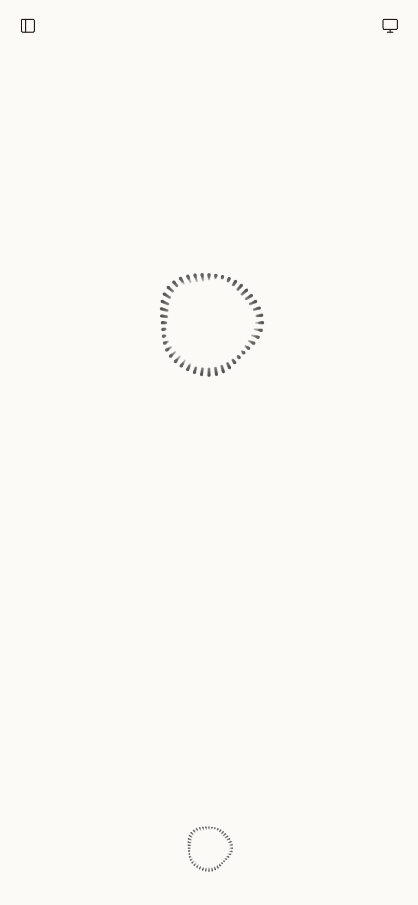<br>Empty | 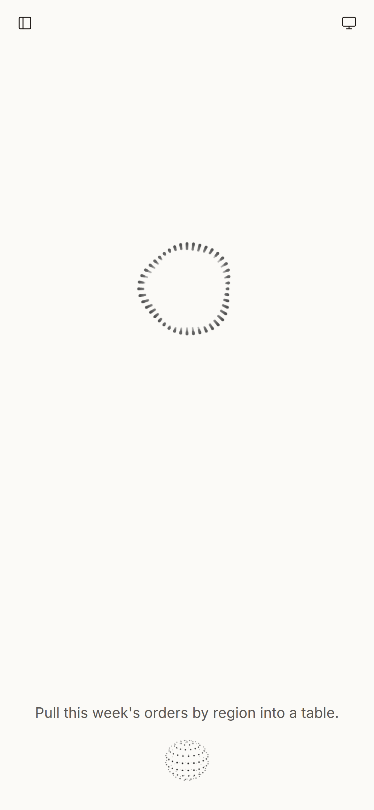<br>Listening | 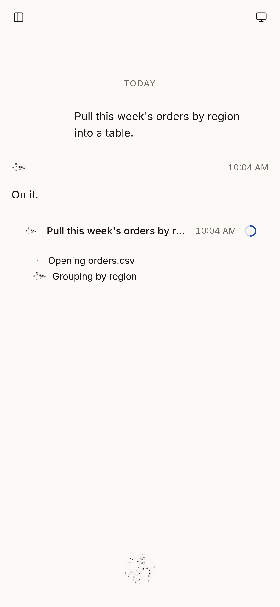<br>Working |
| 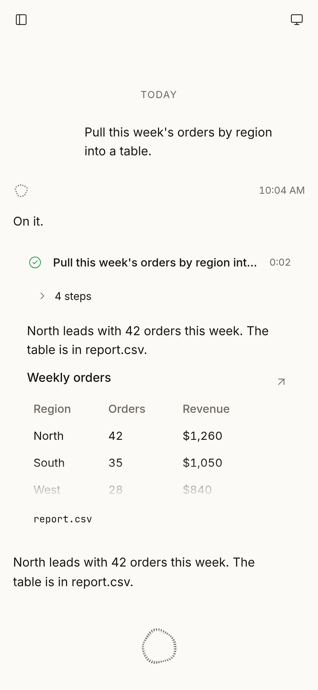<br>Done | 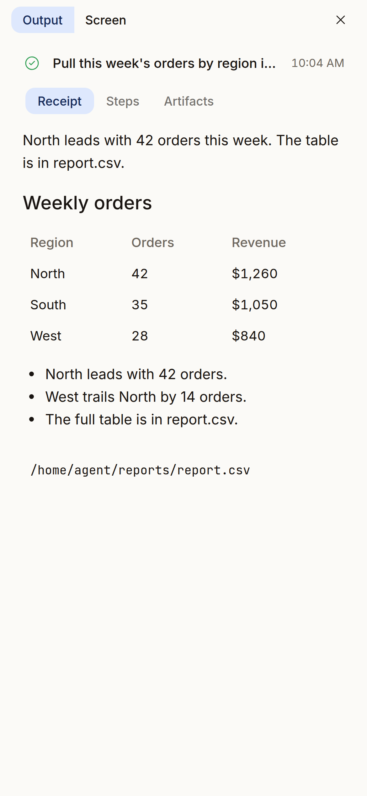<br>Receipt | 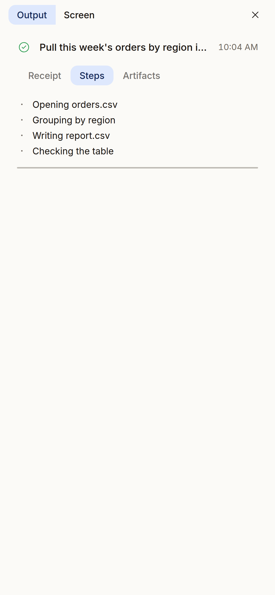<br>Steps |
| 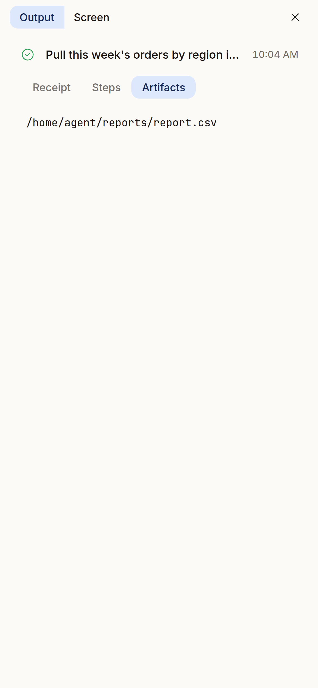<br>Artifacts | 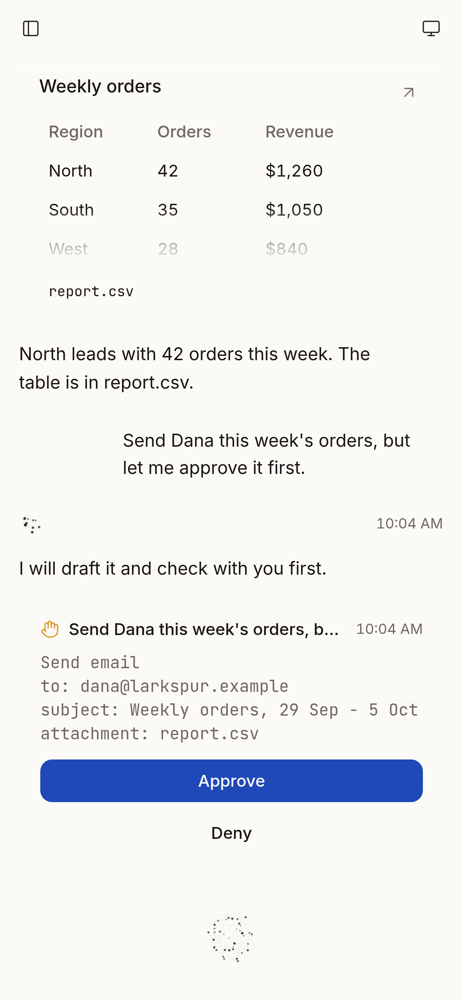<br>Approval | 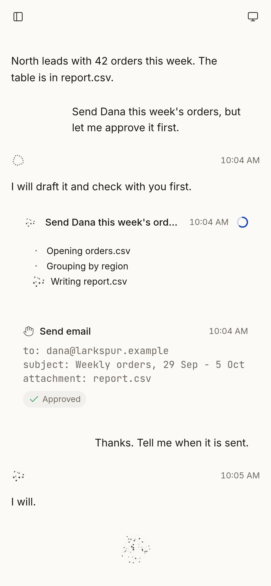<br>Approved |
| 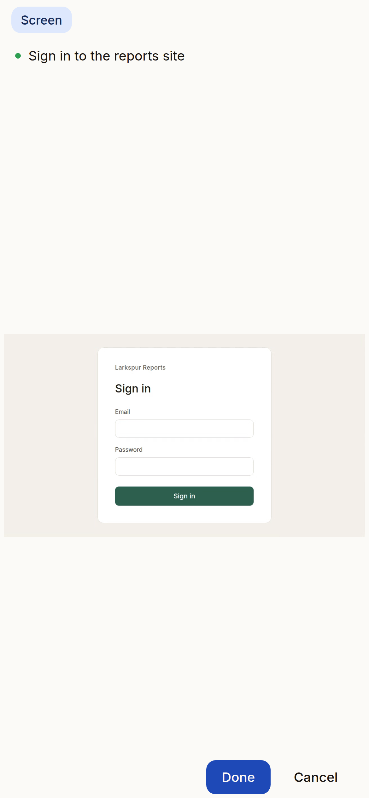<br>Handoff | 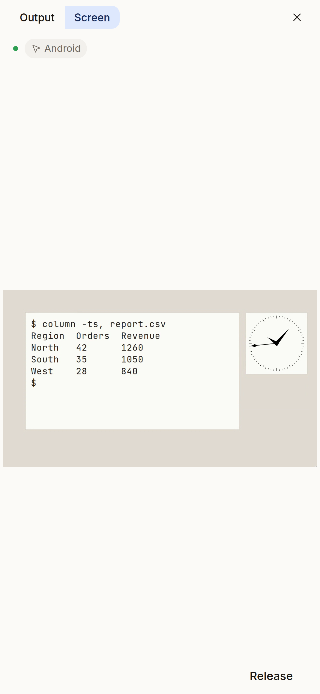<br>Screen | 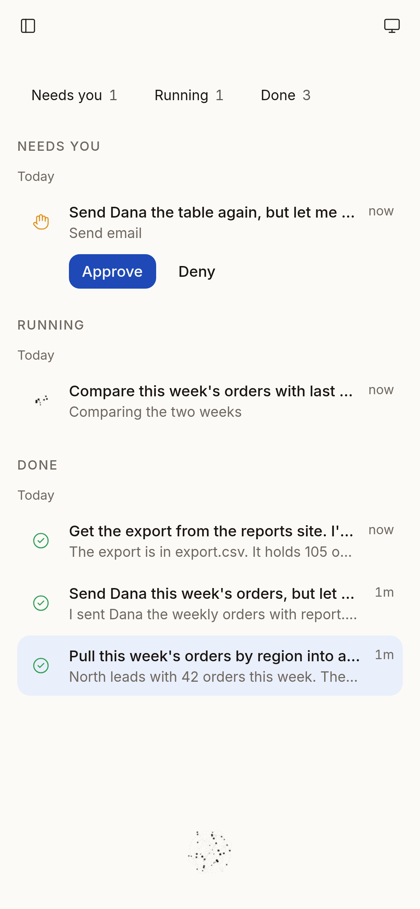<br>Jobs |
| 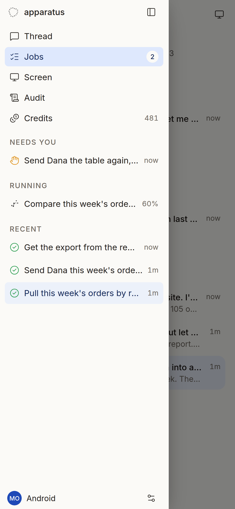<br>Rail | 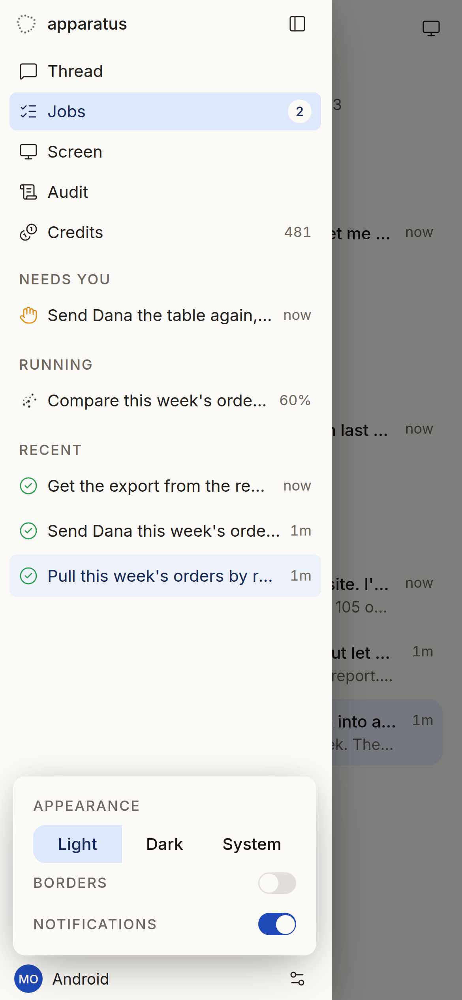<br>Settings | 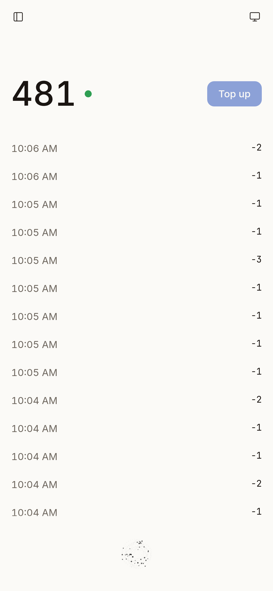<br>Credits |
| 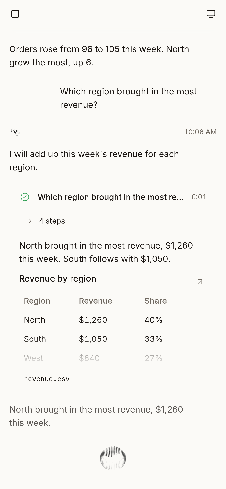<br>Speaking | 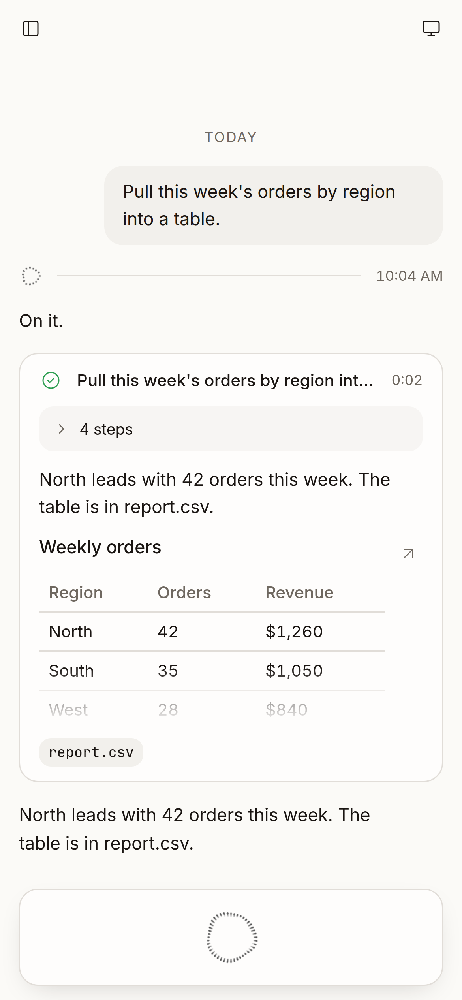<br>Borders on | |

Each phone screen has a `-dark` twin, for example `phone/phone-1-empty-dark.png`.
